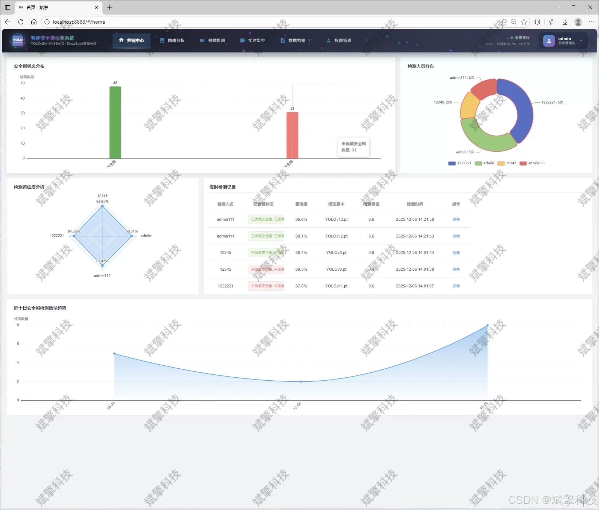
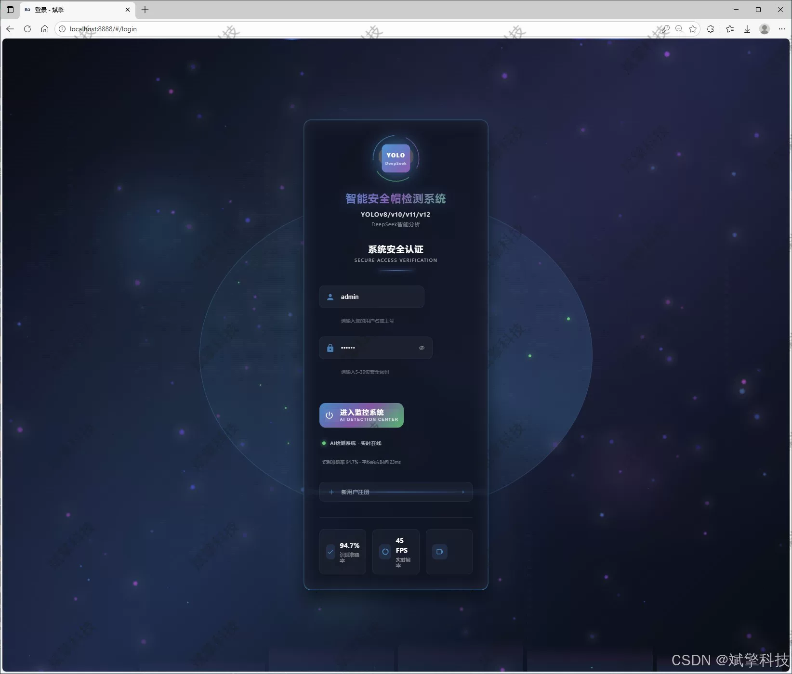
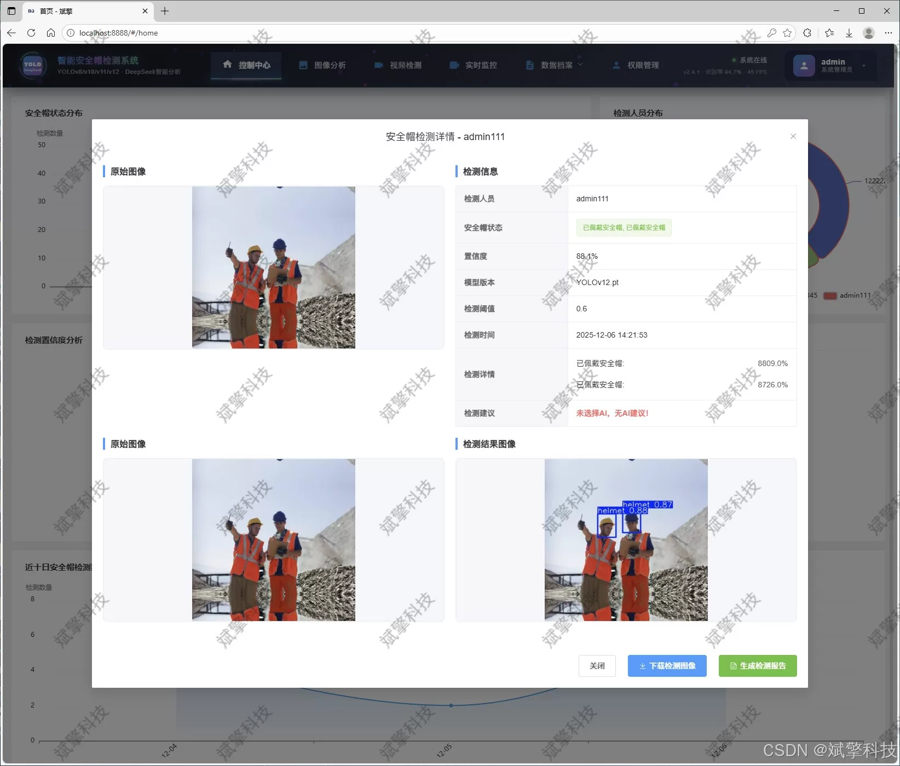
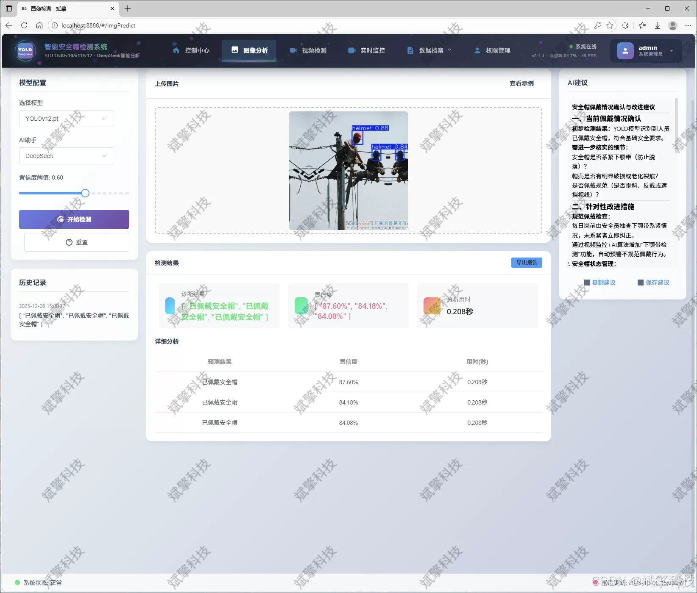
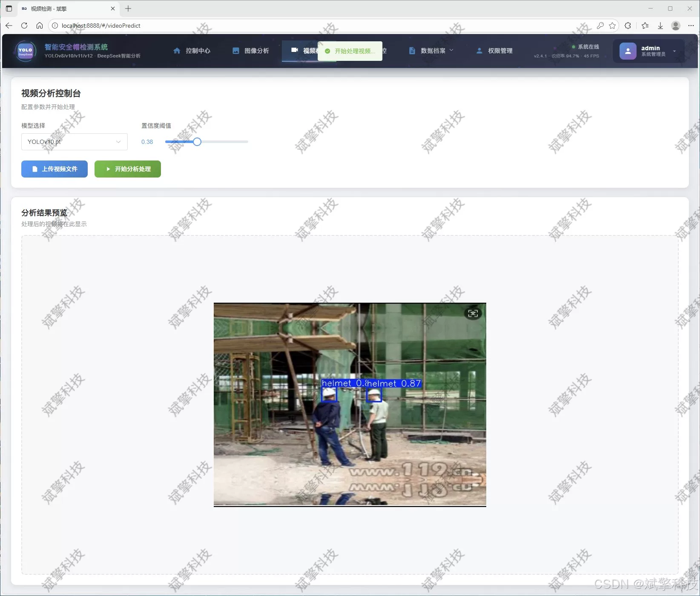
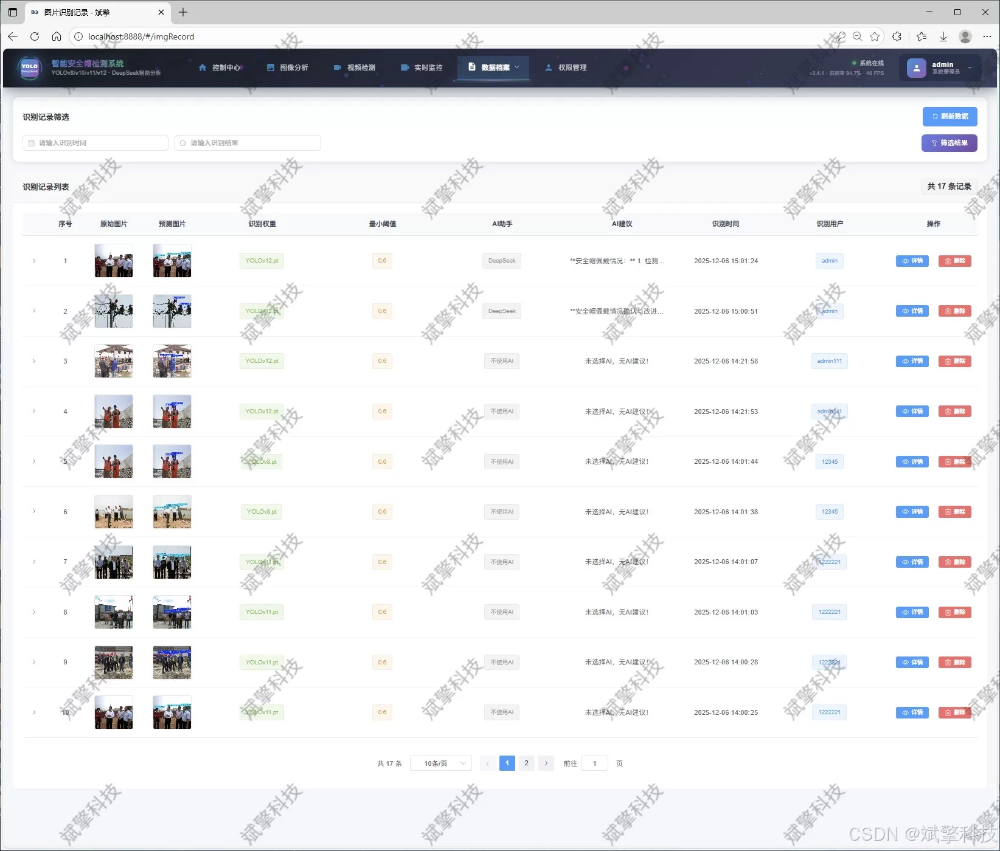
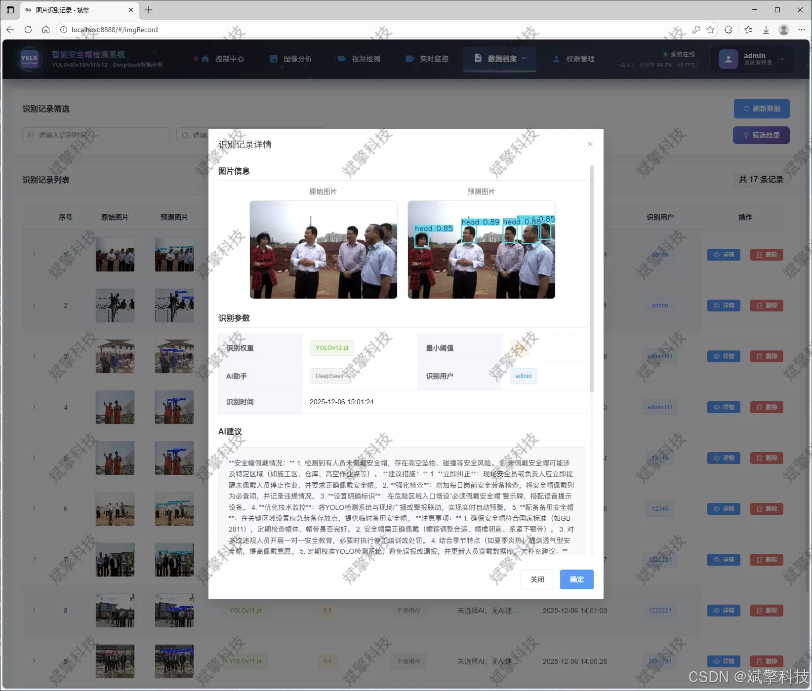
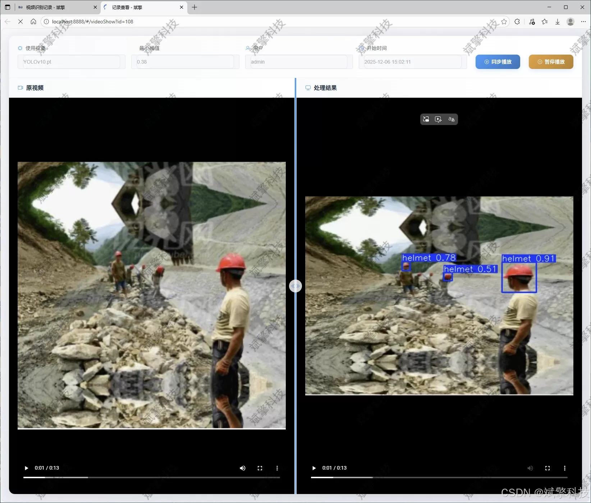
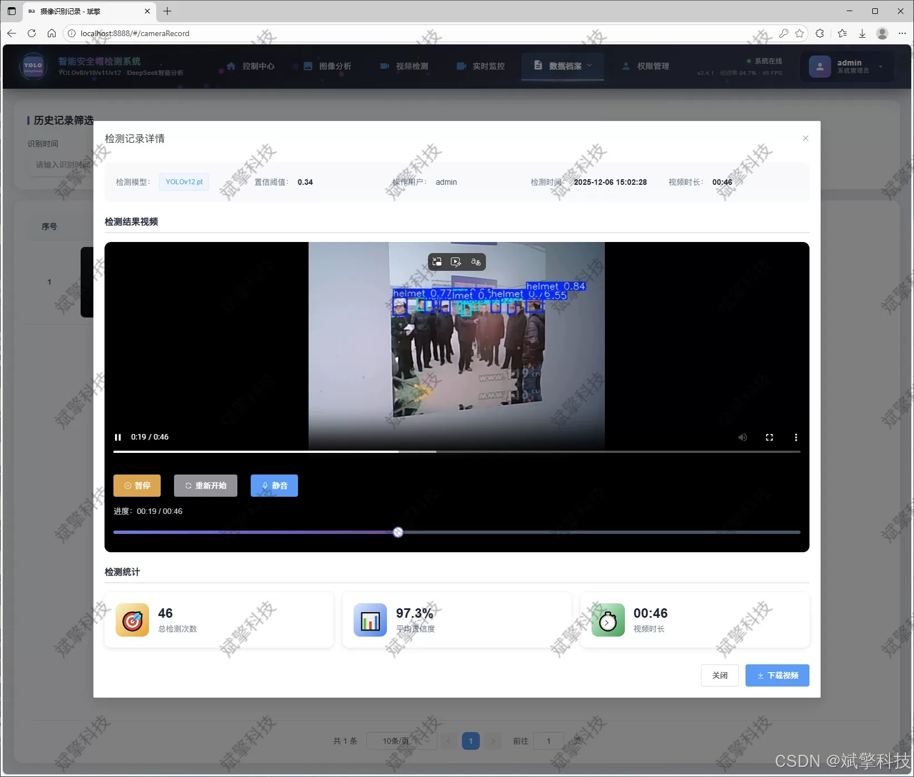

# YOLO Safety Helmet Recognition Software Resources

## Body

YOLO Safety Helmet Recognition Software Resources Based on YOLO Deep Learning and Major Models like Qianwen, DeepSeek for the Safety Helmet Wearing Recognition and Detection System (DeepSeek Intelligent Analysis + Web Interaction Interface + Front-End-Back-End Separation + YOLO Data + YOLOv8/YOLOv10/YOLOv11/YOLOv12)

This article provides a detailed introduction to a comprehensive and advanced "Safety Helmet Wearing Recognition and Detection System" based on deep learning. The system aims to solve the difficult problem of personnel safety supervision in high-risk scenarios such as industrial production, construction sites, and power inspection. The core of the system utilizes the most cutting-edge YOLO series object detection models (integrated with YOLOv8, YOLOv10, YOLOv11, and YOLOv12), achieving high precision and real-time detection for both "safety helmets" (helmet) and "heads" (head, i.e., not wearing a safety helmet). The project not only constructs a robust algorithm backbone but also innovatively develops a modern Web application interface, adopting a front-end-back-end separation architecture to ensure system maintainability and scalability. The system is fully functional, supporting image, video, and real-time camera stream detection modes, and integrates the intelligent analysis function of the DeepSeek large language model, capable of generating descriptive reports based on detection results. All detection records and user data are persistently stored in a MySQL database, complemented by rich data visualization charts. The system management module is comprehensive, including user login registration, personal center, and comprehensive management of user and recognition records by administrators. This system combines cutting-edge computer vision technology with practical software engineering practices, providing an efficient and reliable integrated solution for the intelligent and regularized supervision of safe production.

Functional modules

✅ Information visualization, data visualization.

✅ AI analysis support for image detection through deepseek and Qianwen.

✅ Support for image detection, video detection, and real-time camera stream detection, with detection results saved to a MySQL database.

✅ Image recognition record management, video recognition record management, and camera recognition record management.

✅ User management module, allowing administrators to add, delete, update, and view users.

✅ Personal center, where users can modify their information, including passwords, names, and profile pictures.

## Images

## Payment

Here is a pay link on Stripe ( https://buy.stripe.com/3cs8yP7sY87d0vu9AB ). Please contact me lonlonago@foxmail.com after funding $89, and I will send you a complete data files , thank you!

